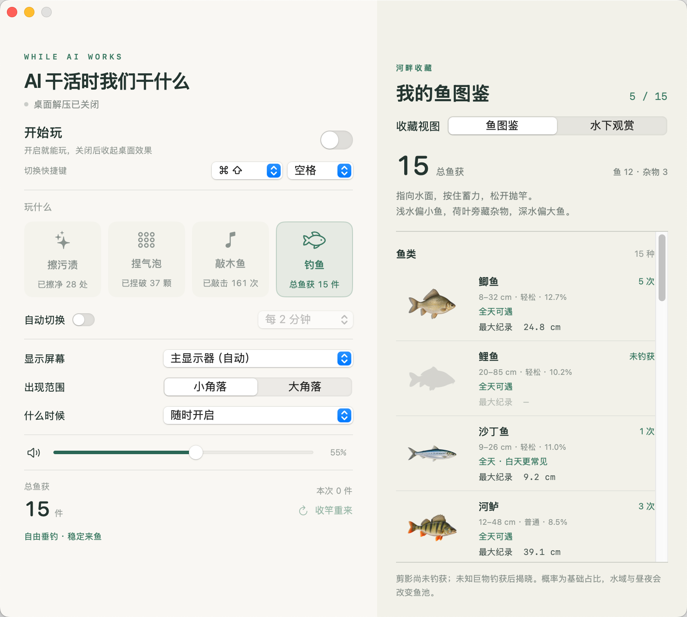
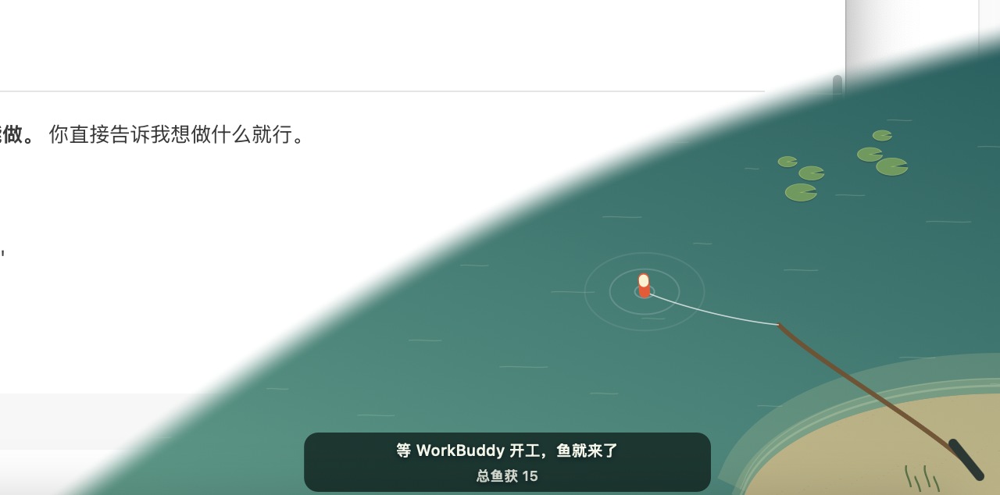
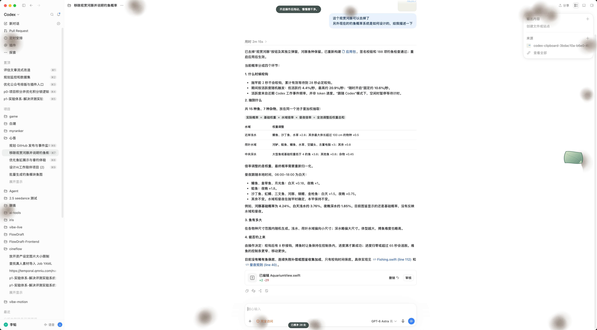
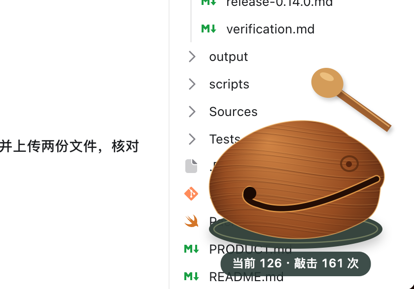

# AI 干活时我们干什么

**AI 负责写代码，我负责不闲着。**

某天下午，我把需求交给了 Codex。它开始看代码、改文件、跑测试。我盯着屏幕，突然发现自己没什么事可干了。

于是，我给自己找了份新工作。

我做了个监听 Codex 工作的小工具。它一开工，桌面就开始长污渍，我拿着小抹布去擦。它解决代码里的问题，我解决屏幕上的问题。

从程序员转岗桌面保洁，只用了一个下午。

**但我没有离开项目，只是换了个部门。**

后来，部门逐渐扩张：捏气泡、敲木鱼，以及最重要的——钓鱼。选了「跟随 AI」，它开工，鱼才开始来；它忙得越起劲，水面就越热闹。

以前盯着 AI 干活，是怕它出错。现在盯着 AI 干活，是怕它提前下班。

毕竟这边刚上鱼。

如今也能跟随 Qoder 和 WorkBuddy。无论哪个 Agent 在埋头工作，人类这边总有点事忙。

**主打一个：人和 AI 都有事做。**

## 人类这边的工作现场

**配置页面 · 给自己安排一个岗位**

玩法、声音、快捷键，以及今天的渔业成果，都在这里。

**钓鱼 · 等 AI 开工，也等鱼上钩**

Agent 还没开工，渔业部先把竿架好。

**擦污渍 · 从程序员转岗桌面保洁**

它埋头写代码，我顺手擦桌面。谁也没闲着。

**敲木鱼 · 代码它来写，功德你来补**

代码那边还在跑，人类这边也有自己的进度条。

## 给自己找点事做

- **桌面保洁**：拿起小抹布，把 AI 干活时冒出来的污渍擦干净。
- **气泡解压**：点一下，捏一个；划过去，捏一排。
- **精神支持**：AI 工作时木鱼数值每 5 秒 −1，你敲一下 +1。代码它来写，功德你来补。
- **渔业生产**：蓄力抛竿，等鱼咬钩，提竿收鱼。它越忙，来鱼越勤。
- **下班观赏**：钓到的鱼有自己的图鉴和纪录，也能放进水下世界，慢慢看它们游。

想自己安静玩一会儿，也可以选「随时开启」。不必等 AI 上班。

## 下载开玩

[下载 Mac 测试版](https://github.com/xiaoyan648/while-ai-works/releases/tag/v0.14.0-beta.1)

适用于 **M 系列芯片的 Mac，macOS 14 或更新版本**。暂不支持 Intel Mac 和 Windows。

1. 下载页面里的 `.zip` 文件，解压后将 **While AI Works.app** 拖入「应用程序」。
2. 打开应用，点击「开始玩」，选一种玩法。
3. 按 **⌘⇧空格** 随时收起桌面效果，回去看看 AI 干得怎么样。

如果首次打开被系统拦住，确认是从本仓库下载后，在「系统设置 → 隐私与安全性」中选择「仍要打开」。也可参照 [Apple 的操作说明](https://support.apple.com/zh-cn/102445)。

## 和你的 AI 一起上班

在「什么时候」里选择 **Codex、Qoder 或 WorkBuddy**。

Codex 可直接跟随。Qoder / WorkBuddy 首次使用需要点击「安装监听」，再重启对应客户端；如果客户端弹出配置确认，按提示启用即可。

每次跟随一个客户端。它工作时，桌面玩法跟着热闹起来；它结束后，剩下的可以继续玩。

[连接与使用说明](INTEGRATIONS.md)

## 放心摸鱼

不需要注册账号，不读取桌面画面，也不会上传你的对话或代码。鱼获、图鉴和累计记录都留在自己的 Mac 上。

关闭设置窗口后，应用仍留在菜单栏。显示屏幕、音量、自动轮换和快捷键都可以自己调整。

## 一起养这个小玩具

现在是测试版。Qoder / WorkBuddy 的连接还需要更多真实使用反馈；如果状态没跟上，可以先切回「随时开启」。

遇到问题或想到好玩的新玩法，欢迎 [来聊聊](https://github.com/xiaoyan648/while-ai-works/issues)。描述一下你用的 Mac、AI 客户端，以及发生了什么就好，不用贴私人对话或代码。

本仓库提供应用下载和使用说明，暂不公开源码。
